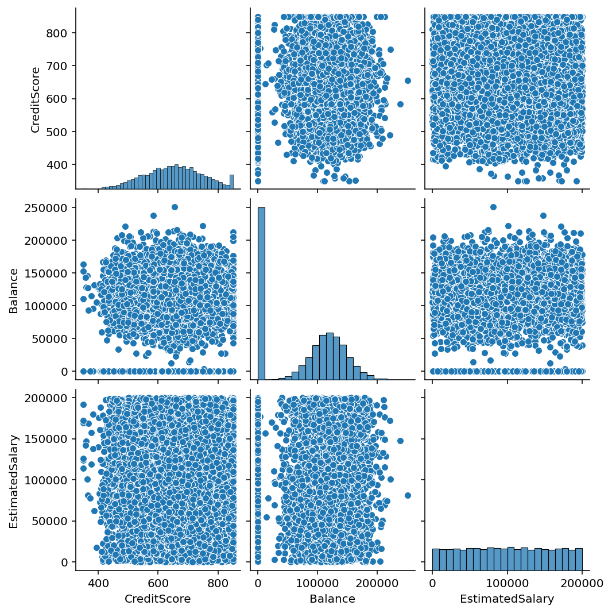

# Customer Churn Prediction using Artificial Neural Network (ANN)

## 📌 Project Overview

Customer churn prediction is one of the most important applications of Machine Learning in the banking and telecommunications industries. This project uses an Artificial Neural Network (ANN) built with TensorFlow and Keras to predict whether a customer is likely to leave the bank based on customer demographics, account information, and transaction-related features.

The model incorporates data preprocessing, target encoding, class balancing using SMOTE, feature scaling, ANN model training, and performance evaluation.

---

## 🚀 Features

* Data preprocessing and feature engineering
* Target Encoding for categorical variables
* Handling class imbalance using SMOTE
* Feature scaling using MinMaxScaler
* Deep Learning model using TensorFlow/Keras
* Model evaluation using:

  * Accuracy Score
  * Confusion Matrix
  * Classification Report
* Data visualization using Seaborn and Matplotlib

---

## 📂 Dataset

Dataset Used: **Churn_Modelling.csv**

The dataset contains customer information such as:

* Credit Score
* Geography
* Balance
* Number of Products
* Credit Card Status
* Active Membership Status
* Estimated Salary
* Complaint Status
* Customer Exit Status (Target Variable)

### Target Variable

| Column | Description                            |
| ------ | -------------------------------------- |
| Exited | 1 = Customer Left, 0 = Customer Stayed |

---

## 🛠️ Technologies Used

* Python
* Pandas
* NumPy
* TensorFlow / Keras
* Scikit-Learn
* Imbalanced-Learn (SMOTE)
* Category Encoders
* Matplotlib
* Seaborn

---

## 📋 Project Workflow

### 1. Data Collection

Load the customer churn dataset using Pandas.

### 2. Data Preprocessing

* Select relevant features
* Encode categorical variables
* Handle missing values (if any)

### 3. Target Encoding

Convert the Geography column into numerical values using Target Encoding.

### 4. Handle Class Imbalance

Apply SMOTE (Synthetic Minority Oversampling Technique) to balance churn and non-churn classes.

### 5. Feature Scaling

Normalize feature values using MinMaxScaler.

### 6. Train-Test Split

Split data into:

* Training Set (75%)
* Testing Set (25%)

### 7. Build ANN Model

The ANN consists of:

* Multiple Hidden Layers
* ReLU Activation Function
* Sigmoid Activation Function in Output Layer

### 8. Model Training

Train the network using:

* Adam Optimizer
* Binary Crossentropy Loss Function

### 9. Model Evaluation

Evaluate performance using:

* Accuracy Score
* Confusion Matrix
* Classification Report

### 10. Data Visualization

Visualize feature relationships using:

* Pair Plot
* Violin Plot
* Histograms

---

## 🧠 ANN Architecture

```text
Input Layer
      │
      ▼
Dense Layer (8 Neurons, ReLU)
      │
Dense Layer (8 Neurons, ReLU)
      │
Dense Layer (8 Neurons, ReLU)
      │
...
      │
Dense Layer (8 Neurons, ReLU)
      │
      ▼
Output Layer (1 Neuron, Sigmoid)
```

---

## 📊 Evaluation Metrics

The model performance is evaluated using:

### Accuracy Score

```python
accuracy_score(y_test, predictions)
```

### Confusion Matrix

```python
confusion_matrix(y_test, predictions)
```

### Classification Report

```python
classification_report(y_test, predictions)
```

---

## 📈 Visualizations

### Pair Plot

Displays relationships between:

* Credit Score
* Balance
* Estimated Salary

### Violin Plot

Shows salary distribution across product categories.

### Histograms

Displays the distribution of selected numerical features.

---

## 📷 Project Screenshot


```markdown


!(images/violinplot.png)
---

## 📦 Requirements

```text
pandas
numpy
tensorflow
matplotlib
seaborn
scikit-learn
imbalanced-learn
category-encoders
```

---

